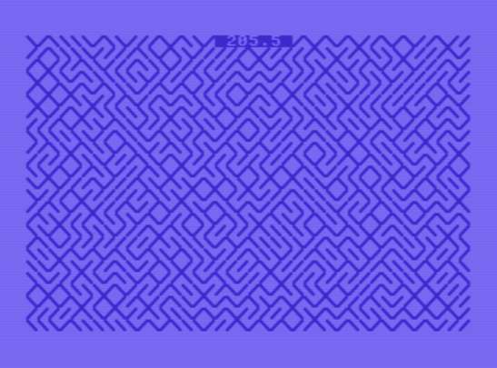

## Kahden merkin muodostamia kuvioita

Kahta merkkiä käyttäen muodostuvia erilaisia kuvioita. Alkujaan yksirivinen ohjelma 8-Bit Show And Tell -kanavalta.

> [!NOTE]
> _Enemmän aiheesta 8-Bit Show And Tell kanavan videolla https://www.youtube.com/watch?v=MVQJykMJSH0_



Oheinen listaus on muotoiltu niin, että sen voi kopioida ja liittää sellaisenaan VICE-emulaattorin ikkunaan. Tarvittaessa kirjoita ensin `new` -komento (poistaa aiemman Basic-ohjelman muistista).

Aja ohjelma run -komennolla. Stoppaa ohjelma emulaattorissa esc-näppäimellä (= stop-näppäin).

```
10 rem inspiraatio 8-bit show and tell
20 rem youtube kanavalta
30 en = 25 * 40 - 1 + 1024
40 for ch = 205.0 to 206.0001 step 0.1
50 for i = 1024 to en
60 if i = 1048 then gosub 130 : print str$(ch);" "
70 poke i, ch + rnd(1)
80 next i
90 for d=1 to 1000 : next d
100 next ch
110 goto 110
120 rem kursori kohtaan 0,17
130 poke 214,0
140 poke 211,17
150 sys 58732
160 return

```
